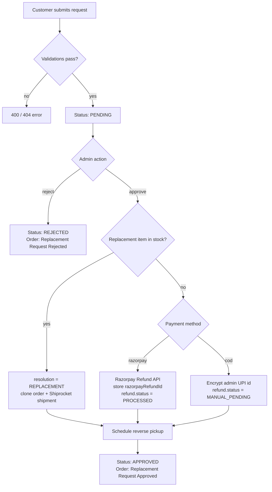

# Product Replacement & Refund

How the replacement/refund workflow is built, and every validation enforced along the way.

## Overview

Customers can request a replacement for a **delivered** order within **3 days** of delivery.
An admin reviews the request and either approves or rejects it. On approval the system
automatically decides between a **replacement** (item in stock) or a **refund** (item out of
stock), always schedules a **reverse pickup** of the returned item, and keeps the order status
in sync.

Everything lives in a dedicated module so replacement requests are their own queryable records
(not embedded in the order):

| Concern | File |
|---|---|
| Data model | [models/replacementRequest.js](../models/replacementRequest.js) |
| Customer controller | [controllers/replacementController.js](../controllers/replacementController.js) |
| Admin controller | [controllers/admin/replacementController.js](../controllers/admin/replacementController.js) |
| Customer routes | [routes/replacementRoutes.js](../routes/replacementRoutes.js) |
| Admin routes | [routes/admin/replacementRoutes.js](../routes/admin/replacementRoutes.js) |
| Video upload middleware | [middlewares/replacementUpload.js](../middlewares/replacementUpload.js) |
| UPI encryption helper | [utils/encryption.js](../utils/encryption.js) |
| Razorpay refund service | [payment/payment.service.js](../payment/payment.service.js) |
| Shiprocket reverse pickup | [services/shiprocketService.js](../services/shiprocketService.js) |

## Endpoints

### Customer (`/api/replacements`, requires login)

| Method | Path | Purpose |
|---|---|---|
| `POST` | `/api/replacements/:orderId` | Create a replacement request (multipart: photos JSON + optional `video` file) |
| `GET`  | `/api/replacements` | List the caller's own requests |

### Admin (`/api/admin/replacement-requests`, requires admin role)

| Method | Path | Purpose |
|---|---|---|
| `GET`   | `/` | List + filter by `?status=PENDING\|APPROVED\|REJECTED` |
| `GET`   | `/:id` | View a request (reason + photos, no restriction) |
| `GET`   | `/:id/video` | Download the evidence video **once** |
| `GET`   | `/:id/refund-upi` | Reveal the decrypted manual-refund UPI id (admin only) |
| `PATCH` | `/:id/approve` | Approve → auto replacement or refund |
| `PATCH` | `/:id/reject` | Reject with `rejectionReason` |

## Request lifecycle

## Approval decision logic

On `PATCH /:id/approve`:

1. **Idempotency guard** — only a `PENDING` request can be approved; anything else returns
   `400 Request already approved/rejected`. This prevents a refund from firing twice.
2. **Stock check** — reads `product.stock` for the requested item and compares against the
   ordered quantity.
   - **In stock → `REPLACEMENT`**: a replacement order is cloned from the original and a new
     Shiprocket outbound shipment is created. No refund is issued.
   - **Out of stock → `REFUND`**:
     - **Razorpay orders**: calls `paymentService.refundPayment(razorpayPaymentId, amount, reason)`
       using the original payment id, stores `refund.razorpayRefundId`, sets
       `refund.status = PROCESSED`. If Razorpay fails, `refund.status = FAILED` and the endpoint
       returns `502` without marking the request approved.
     - **COD orders**: require an admin-entered UPI id. It is **encrypted at rest** and
       `refund.status = MANUAL_PENDING` for manual payout.
3. **Reverse pickup** — `shiprocketService.createReturnPickup` is always called to move the
   returned item from the customer back to the warehouse.
4. Request → `APPROVED`; order status → `Replacement Request Approved`.

On `PATCH /:id/reject`: request → `REJECTED`, order status → `Replacement Request Rejected`,
`rejectionReason` saved.

## Validations enforced

### Request creation (customer)

| Rule | Result if violated |
|---|---|
| Order must exist **and** belong to the caller | `404 Order not found` |
| Order status must be `delivered` | `400 Order not delivered` |
| Delivered within the last 3 days (`deliveredAt`) | `400 Replacement period expired` |
| `reason` must be one of `DAMAGED / WRONG_ITEM / SIZE_ISSUE / QUALITY_ISSUE / OTHER` | `400 Invalid replacement reason` |
| `reasonText` required when `reason === OTHER` | `400 reasonText is required when reason is OTHER` |
| No existing `PENDING`/`APPROVED` request for the order | `400 A replacement request already exists` |

### Photos (ImageKit)

- Photos are sent as `{ url, fileId }` references — the API never handles image bytes.
- Every URL must start with our `IMAGEKIT_URL_ENDPOINT`; foreign URLs are rejected
  (`400 Photo URL is not from an allowed image source`). This blocks attackers from smuggling
  arbitrary external links into stored records.

### Video (server-side, never trusts the client)

Handled in [middlewares/replacementUpload.js](../middlewares/replacementUpload.js):

- **multer single upload** with `limits.fileSize = 50MB` → `400 Video exceeds the 50MB limit`.
- **Extension** must be `mp4 / webm / mov`.
- **MIME type** must be `video/mp4 / video/webm / video/quicktime`.
- **Magic-byte re-check** after upload: mp4/mov must contain the `ftyp` box at offset 4; webm
  must start with the EBML signature `1A 45 DF A3`. Files that pass the extension/MIME check but
  are not real videos are deleted and rejected (`400 Uploaded file is not a valid video`).
- Stored under backend-controlled `uploads/videos/replacements` and **never** exposed as a public
  URL — direct static access to that folder is blocked with `403` in
  [app.js](../app.js). The `storagePath` field is `select:false` so it never leaks in API responses.

### Video download-once (admin)

- If `video.downloadCount >= 1` → `403 Video already downloaded`.
- Otherwise the download is claimed **atomically** with a conditional
  `findOneAndUpdate({ 'video.downloadCount': { $lt: 1 } }, { $inc: 1, downloadedAt, downloadedBy })`,
  so two concurrent admin requests can never both succeed. The file is then streamed from
  backend storage.

### Security

- **UPI id encryption**: manual-refund UPI ids are encrypted with AES-256-GCM
  ([utils/encryption.js](../utils/encryption.js), keyed by `ENCRYPTION_KEY`). The field is
  `select:false`; the plaintext is only returned through the admin-authenticated
  `GET /:id/refund-upi` endpoint. A masked value (`abc***@bank`) is stored for display.
- **Refund idempotency**: the `PENDING`-only approve guard ensures a refund can't double-fire.
- **All size/type checks are server-side** — the client is never trusted for validation.

## Data model summary

`ReplacementRequest` ([models/replacementRequest.js](../models/replacementRequest.js)):

- `order` (ref, required), `productId` (ref), `user` (ref, required)
- `reason` (enum), `reasonText` (required when `OTHER`)
- `photos: [{ url, fileId }]`
- `video: { storagePath (hidden), filename, mimetype, size, downloadCount, downloadedAt, downloadedBy }`
- `status`: `PENDING | APPROVED | REJECTED` (default `PENDING`)
- `resolution`: `REPLACEMENT | REFUND | null`
- `refund: { method (RAZORPAY|UPI_MANUAL), upiId (encrypted, hidden), upiIdMasked, razorpayRefundId, amount, status, processedAt }`
- `reversePickup: { scheduled, scheduledAt, provider, reference }`
- `replacementOrder` (ref), `rejectionReason`, audit fields, timestamps

## Required environment variables

| Variable | Used for |
|---|---|
| `ENCRYPTION_KEY` | AES-256-GCM key for encrypting manual-refund UPI ids |
| `IMAGEKIT_URL_ENDPOINT` | Validating that photo URLs are ours |
| `RAZORPAY_KEY_ID` / `RAZORPAY_KEY_SECRET` | Razorpay refunds |
| `SHIPROCKET_EMAIL` / `SHIPROCKET_PASSWORD` | Shiprocket auth |
| `SHIPROCKET_WAREHOUSE_*` (optional) | Return/warehouse address for reverse pickup |

## Note on the previous implementation

The earlier embedded flow (`Order.returnRequest` + `orderController.requestReturn` /
`handleReturnRequest` / `downloadReplacementMedia` and their routes) has been removed in favor of
this module. The `Order.returnRequest` field itself is retained because
`paymentService.refundPayment` and the admin export report still read/write it.
